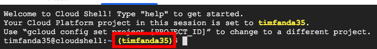

# GCP Custom Roles

I can not create the custom role from Editor role, because there's the maximum of 2087 permissions in a custom role.

# Steps

1. Open Cloud Console.

2. Select Project.


3. Open Cloud Shell.


4. Confirm the Cloud Shell has set the correct project. If not, reopen Cloud Shell.



## Create a Limit Editor

Execut below code in Cloud Shell:

```
gcloud iam roles create limiteditor \
  --project=$(gcloud config get-value core/project) \
  --file=<(curl -so- https://raw.githubusercontent.com/timfanda35/gcp-custom-roles/master/limitEditor.yml)
```

Refresh page.
